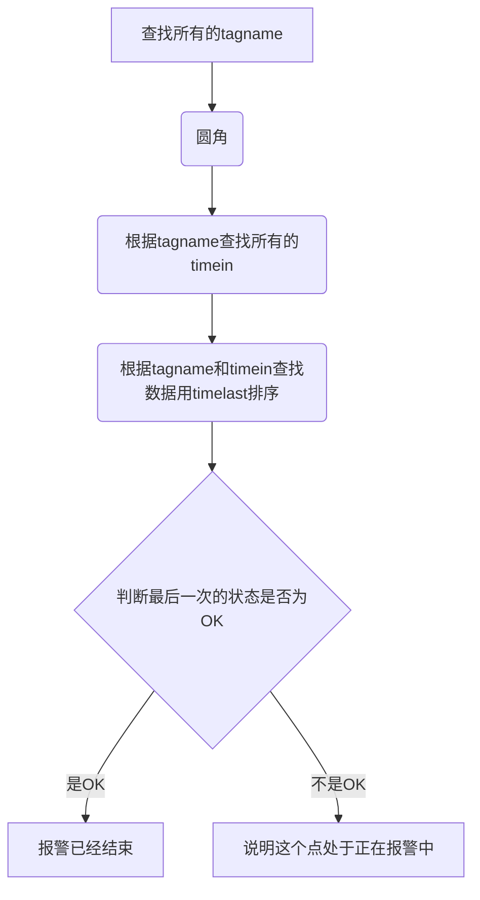

### 取出表中所有tagname

select ALM_TAGNAME from [ceshi].[dbo].[FIXALARMS2] group by ALM_TAGNAME

### 根据tagname查出所有的timein点

select ALM_NATIVETIMEIN from [ceshi].[dbo].[FIXALARMS2] where ALM_TAGNAME='tagname' group by ALM_NATIVETIMEIN

### 根据tagname和timein的点查出所有的数据然后根据timelast进行排序

select * from [ceshi].[dbo].[FIXALARMS2] where ALM_TAGNAME='tagname' and ALM_NATIVETIMEIN='timein' order by ALM_NATIVETIMELAST

### 判断最后一次状态是否为OK

不是ok的话，则是正在进行报警的点

